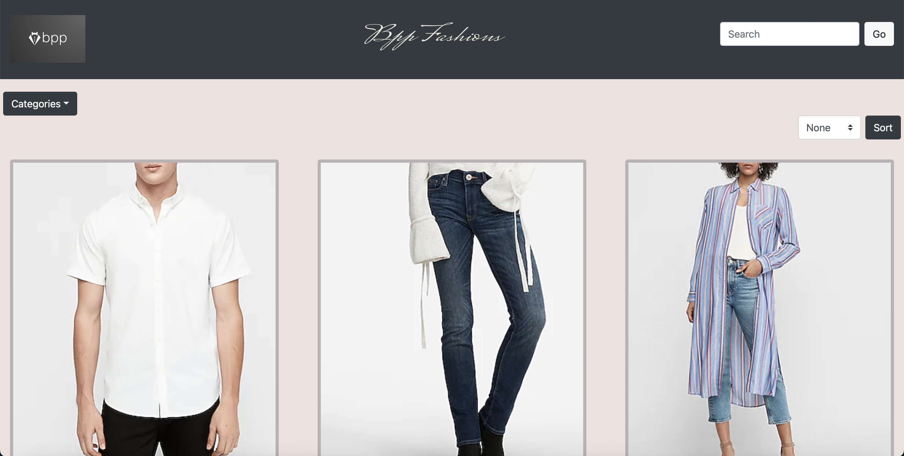
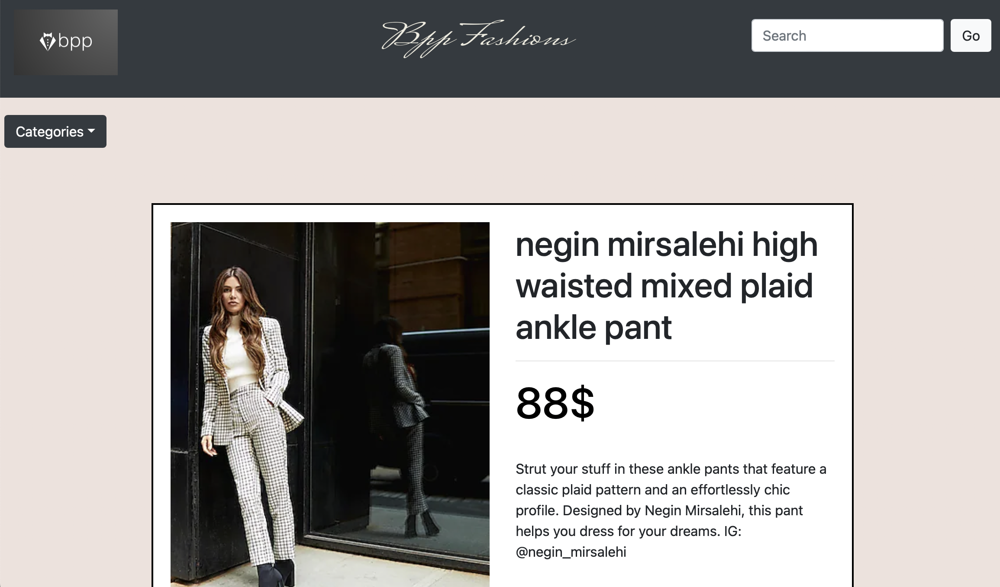
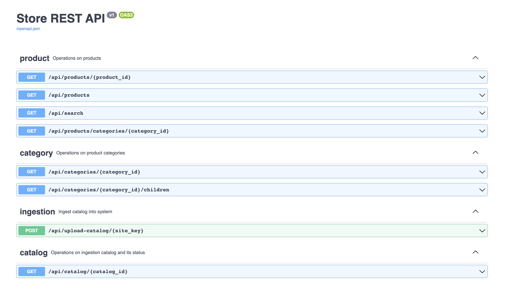

# BPP Fashions
An E-commerce website for a small business selling apparels.
It is powered by Unbxd Search while also having additional features such as Category Dropdowns,Pagination as well as Product Sort.The backend is developed on flask and the frontend is developed using html,css and javascript.

## Usage

1. Documentation

   - API documentation can be found at https://documenter.getpostman.com/view/25395677/2s935hR7YR#01e8c7b0-1bfc-4265-b890-0cea11b53ffa
   - In docker builds, API specification by Swagger-UI is accessible as mentioned below.

2. Pre-requisites
    - ```.env```: Contains environment variables.
    - ```out.json```: Contains catalog data.
    - ```SITE_KEY```: Authentication token for site owners. Replace {{SITE_KEY}} with the actual string in API endpoints.
    - ```UNBXD_API_KEY```: Accessing Unbxd's search API.

3. Data Ingestion

   After installation (procedure specified below), data ingestion should be performed to view the products in the site.
   Accessing the app before performing data ingestion can cause 404 errors to show up.

    - Download ```out.json``` containing the data. Link to the file: https://drive.google.com/file/d/1HDOOlNVdZmgiuliwc-a2vstJvMj2xV77/view?usp=sharing
    - Upload the data to the app.
   ```
   curl --location -g --request POST 'localhost:5000/api/upload-catalog/{{SITE_KEY}}' \--form 'file=@"out.json"'
   ```
   Alternative to curl using python:
    ```
    import requests
    
   url = "localhost:5000/api/upload-catalog/{{SITE_KEY}}"
   
    payload={}
   
    files=[
    ('file',('out.json',open('out.json','rb'),'application/json'))
    ]
    
   headers = {}

    response = requests.request("POST", url, headers=headers, data=payload, files=files)

    print(response.text)
   ```
   
   For kubernetes builds, change the url above to ```bpp.fashions.com/api/upload-catalog/{{SITE_KEY}}```

## Installation

Setup the environment by adding a .env file in the /backend/flaskapp directory containing the variables mentioned in .env.sample.
A sample .env file to get a working app is provided below for convenience.

```bash
CACHE_TYPE=redis
CACHE_REDIS_HOST=redis
CACHE_REDIS_PORT=6379
CACHE_REDIS_DB=0
CACHE_REDIS_URL=redis://redis:6379/0
CACHE_DEFAULT_TIMEOUT=500
SITE_KEY=demo-unbxd700181503576558
UNBXD_API_KEY=fb853e3332f2645fac9d71dc63e09ec1
POSTGRES_USER=unbxd
POSTGRES_PASSWORD=postgres
```

You can setup the app using either docker or kubernetes.

### Docker Setup

1. Build Docker Images and Start Containers

```bash
docker-compose --env-file backend/flaskapp/.env up --build -d
```

2. Update /etc/hosts

Add clusterIP to /etc/hosts file for DNS resolution

```bash
echo "127.0.0.1 bpp.fashions.com" | sudo tee -a /etc/hosts
```

If using zsh terminal and above command does not work, try:

```bash
sudo  /bin/bash -c 'echo "127.0.0.1 bpp.fashions.com" | sudo tee -a /etc/hosts'
```

Run the following command to check if a new line is appended to /etc/hosts

```bash
cat /etc/hosts
```


3. Accessing the App

You can access the app at http://bpp.fashions.com

You can access the backend/api at localhost:5000
API specification can be accessed at localhost:5000/api/swagger-ui

### Kubernetes Setup (MacOS)

1. Install minikube

```bash
brew update
brew install kubectl
brew install minikube
```

2. Start a cluster

```bash
minikube start
minikube dashboard
```

If you get an error stating "Unable to pick a default driver", make sure docker desktop is up and running.
Alternatively, you could install drivers such as hyperkit, parallels , qemu2, etc.

If you run into any problems, it is often better to completely remove minikube and restart.

```bash
minikube stop; minikube delete
rm /usr/local/bin/minikube
rm -rf ~/.minikube
# re-download minikube
minikube start
```

3. Run Deployment Script

```bash
sh minikube-deploy.sh
```

Make sure running the deploy script does not give any errors.

If you see 'Internal error occurred: failed calling webhook "validate.nginx.ingress.kubernetes.io"' error, try removing the ValidatingWebhookConfiguration:

```bash
kubectl delete -A ValidatingWebhookConfiguration ingress-nginx-admission
```

4. Update /etc/hosts

Add clusterIP to /etc/hosts file for DNS resolution

```bash
echo "$(minikube ip) bpp.fashions.com" | sudo tee -a /etc/hosts
```

If using zsh terminal and above command does not work, try:

```bash
sudo  /bin/bash -c 'echo "$(minikube ip) bpp.fashions.com" | sudo tee -a /etc/hosts'
```

Run the following command to check if a new line is appended to /etc/hosts

```bash
cat /etc/hosts
```

5. Accessing the App

You can access the app now at http://bpp.fashions.com
In case of <i>503 Internal Server Error</i>, wait a few minutes for the pods to spin up.

6. Accessing the PSQL Database

   - Get the postgres database pod name
      ```bash
      kubectl get pod -l service=postgres -o jsonpath="{.items[0].metadata.name}"
      ````

   - Accessing database
      ```bash
      kubectl exec  $POD_NAME --stdin --tty -- psql -U $POSTGRES_USER
      ```
     
   In the above commands, replace $POD_NAME with the pod name obtained in the first step.
   Replace $POSTGRES_USER with your postgres username (the one specified in .env file).

## Website Screenshots

1.Homepage(Search,Category Dropdown,Sort)


2.Homepage(Pagination)


3.Product Page


4 Swagger-UI API specification


## Links
   - Code Documentation: Readthedocs link to be updated soon.
   - Design Document: https://docs.google.com/document/d/1GcN1fuT-dOzTP50YqLmw67EiM83t6ywPmb8KJRbf54M/edit?usp=sharing
   - Trello Board: https://trello.com/invite/b/My7LhTIB/ATTI52a9c5374f98b6e19bcc6511d61c6f018F82C4EC/task-tracker
   - Postman Documentation: https://documenter.getpostman.com/view/25395677/2s935hR7YR#01e8c7b0-1bfc-4265-b890-0cea11b53ffa


## Salient Features
   - Client side rendering for better user experience.
   - Asynchronous catalog ingestion supported.
   - Customers can view their catalog ingestion status at any time through an API call.
   - Caching implemented using redis.
   - Application supports arbitrary number of category levels.
   - MVC architecture is used.
   - REST principles followed for developing API.
   - Flask blueprints used to simplify migration to microservice architecture in the future, if required.
   - Packaging is done by feature to decrease coupling and increase cohesion.
   - Since python is a dynamically typed language, type hinting is used for type checking and simplifying static code analysis.
   - Unit testing done through pytest.
   - Integration tests written on postman. These are used for regression testing.
   - Sphinx used for generating out-of-the-box beautiful code documentation.
   - API documentation done through Swagger-UI as well as postman.
   - Application can be deployed through docker or kubernetes.

## Note

   - For Mac Intel chip users, you might have to setup hyperkit. Run the following commands:
      ```bash
      brew install hyperkit
      minikube config set vm-driver hyperkit 
      ```
   - Kubernetes setup might give issues on Mac M1 chip.