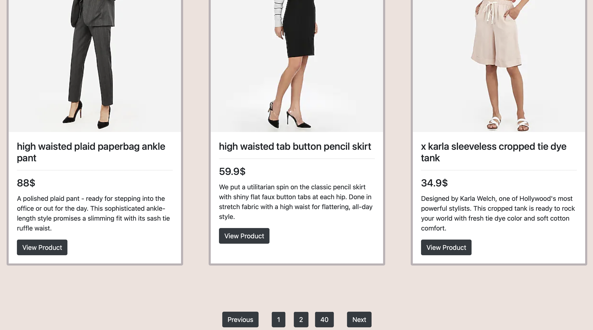

# BPP Fashions
An E-commerce website for a small business selling apparels.
It is powered by Unbxd Search while also having additional features such as Category Dropdowns,Pagination as well as Product Sort.The backend is developed on flask and the frontend is developed using html,css and javascript.

## Installation

### Docker Setup (Backend Only)

1. Build Docker Images and Start Containers

```bash
docker-compose build --no-cache
docker-compose up --build -d
```

2. Accessing the App

You can access the backend/api at localhost:5000
API specification can be accessed at localhost:5000/api/swagger-ui

### Kubernetes Setup (MacOS)

1. Install minikube

```bash
brew update
brew install kubectl
brew install minikube
brew install hyperkit
```

2. Start a cluster

```bash
minikube config set vm-driver hyperkit
minikube start
minikube dashboard
```

If you run into any problems, it is often better to completely remove it and restart.

```bash
minikube stop; minikube delete
rm /usr/local/bin/minikube
rm -rf ~/.minikube
# re-download minikube
minikube start
```

3. Run Deployment Script

```bash
sh minikube-deploy.sh
```

4. Database Setup

   - Get the postgres database pod name
      ```bash
      kubectl get pod -l service=postgres -o jsonpath="{.items[0].metadata.name}"
      ````
   
   - Create a database within the pod
      ```bash
      kubectl exec $POD_NAME --stdin --tty -- createdb -U $POSTGRES_USER bpp
      ```

   - Accessing database
      ```bash
      kubectl exec  $POD_NAME --stdin --tty -- psql -U $POSTGRES_USER
      ```
     
   In the above commands, replace $POD_NAME with the pod name obtained in the first step.
   Replace $POSTGRES_USER with your postgres username (the one specified in .env file).

5. Update /etc/hosts

Add clusterIP to /etc/hosts file for DNS resolution

```bash
echo "$(minikube ip) bpp.fashions.com" | sudo tee -a /etc/hosts
```

6. Accessing the App

You can access the app now at http://bpp.fashions.com
In case of <i>503 Internal Server Error</i>, wait a few minutes for the pods to spin up.

## Usage

1. Documentation

   - API documentation can be found at https://documenter.getpostman.com/view/25395677/2s935hR7YR#01e8c7b0-1bfc-4265-b890-0cea11b53ffa
   - In docker builds, API specification by Swagger-UI is accessible as mentioned above.

2. Pre-requisites
    - ```.env```: Contains environment variables.
    - ```out.json```: Contains catalog data.
    - ```SITE_KEY```: Authentication token for site owners. Replace {{SITE_KEY}} with the actual string in API endpoints.
    - ```UNBXD_API_KEY```: Accessing Unbxd's search API.

3. Data Ingestion

   Perform data ingestion to view the products in the site.
   Accessing the app before performing data ingestion can cause 404 errors to show up.

    - Download ```out.json``` containing the data.
    - Upload the data to the app.
   ```
   curl --location -g --request POST 'localhost:5000/api/upload-catalog/{{SITE_KEY}}' \--form 'file=@"out.json"'
   ```
   Alternative to curl using python:
    ```
    import requests
    
   url = "localhost:5000/api/upload-catalog/{{SITE_KEY}}"
   
    payload={}
   
    files=[
    ('file',('out.json',open('out.json','rb'),'application/json'))
    ]
    
   headers = {}

    response = requests.request("POST", url, headers=headers, data=payload, files=files)

    print(response.text)
   ```

## Website Screenshots

1.Homepage(Search,Category Dropdown,Sort)


2.Homepage(Pagination)


3.Product Page


## Links
   - Design Document: https://docs.google.com/document/d/1GcN1fuT-dOzTP50YqLmw67EiM83t6ywPmb8KJRbf54M/edit?usp=sharing
   - Trello Board: https://trello.com/invite/b/My7LhTIB/ATTI52a9c5374f98b6e19bcc6511d61c6f018F82C4EC/task-tracker
   - Postman Documentation: https://documenter.getpostman.com/view/25395677/2s935hR7YR#01e8c7b0-1bfc-4265-b890-0cea11b53ffa
